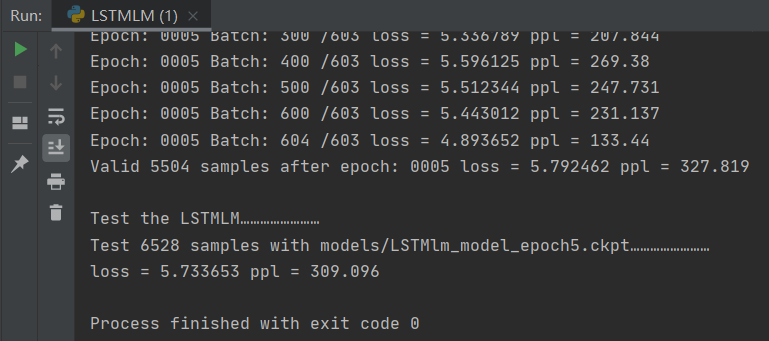
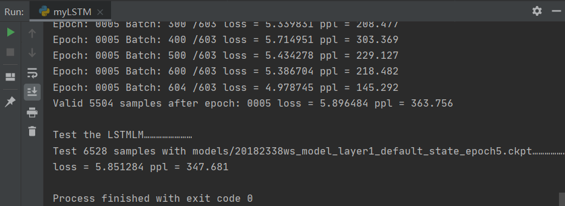
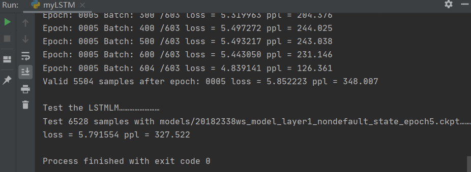
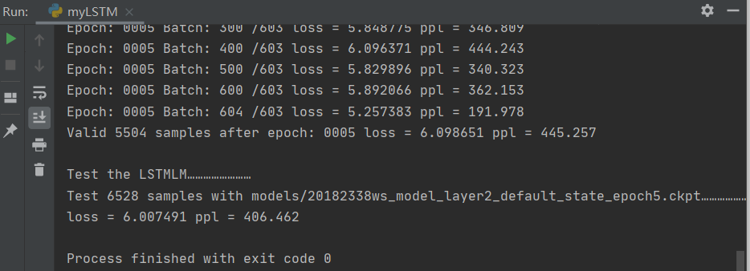
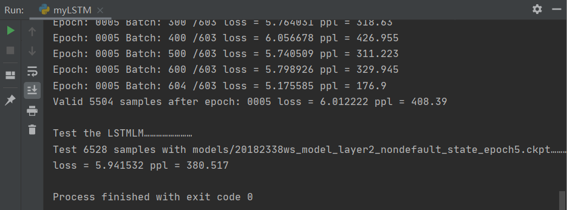
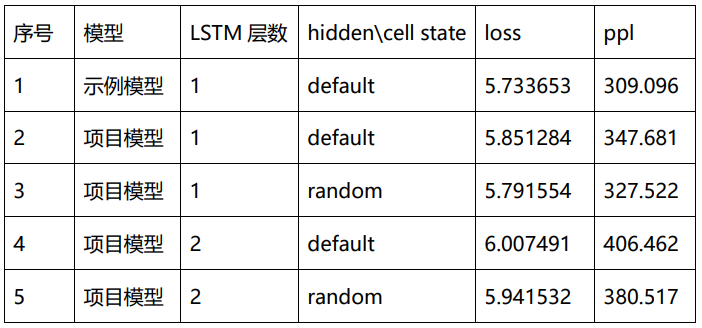

# NLP_work
NLP 课程作业 20182338 王硕 （结合实验报告，食用效果更佳）  
## 目录说明 
myLSTM.py ------------ 项目程序，即自己实现的LSTM模型，代码在第72-227行  
LSTMLM.py ------------ 助教老师给出的示例程序  
give_valid_test.py --- 助教老师给出的示例程序    
penn_small ----------- 助教老师给出的数据集  
models --------------- 是测试过程中，项目程序和示例程序产生的模型  
project-report ------- 实验报告  
pic ------------------ 存放README.md文件需要的图片
## 模型功能
A. 完成基本的LSTM过程  
B. 可以选择LSTM的层数，通过传入参数，实现n(int, ≥1)层LSTM的使用  
C. 可以选择性地传入hidden state, cell state, batch first等参数  
D. 输出outputs，每层最终的hidden state, cell state  
E. 对于模型输入输出的tensor数据，规范了其shape  
## 模型测试
测试生成的模型，保存在了目录models中。  
① 示例程序运行结果（层数=1，默认hidden state，cell state）:  
  
② 项目模型（层数=1，默认hidden state，cell state）：  
  
③ 项目模型（层数=1，随机hidden state，cell state）：  
  
④ 项目模型（层数=2，默认hidden state，cell state）:  
  
⑤ 项目模型（层数=2，随机hidden state，cell state）：
  
### 测试结果：  
  
### 模型已经保存在目录models中，模型名称与图片中的对应  
### The End  

